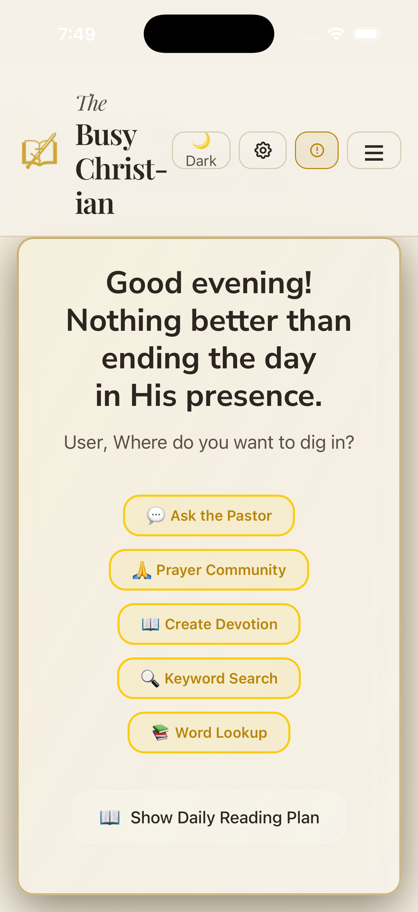
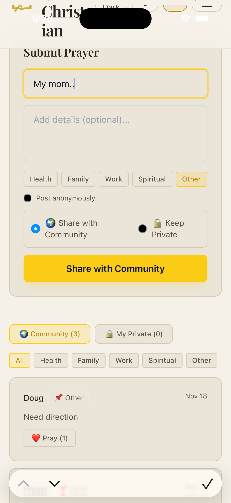

# The Busy Christian

## Product Manual and Investment Prospectus

**Version 5.0**
**December 2025**

---

# COVER SHEET

## The Busy Christian

### AI-Powered Spiritual Companion for Modern Christians

**A Complete Digital Ministry Platform**

---

**Developed by:**
Cornerstone Church
Mandeville, Louisiana

**Contact:**
Doug Gilford
doug.cag@gmail.com

**Live Application:**
https://thebusypreacher.vercel.app

---

*Empowering faith through technology*

---

# TABLE OF CONTENTS

1. [Executive Summary](#executive-summary)
2. [App Screenshots](#app-screenshots)
3. [Vision and Mission](#vision-and-mission)
4. [Product Overview](#product-overview)
5. [Core Features](#core-features)
6. [Technical Architecture](#technical-architecture)
7. [Safety and Crisis Intervention](#safety-and-crisis-intervention)
8. [Administration Console](#administration-console)
9. [Subscription and Monetization](#subscription-and-monetization)
10. [Platform Availability](#platform-availability)
11. [Market Opportunity](#market-opportunity)
12. [Technical Specifications](#technical-specifications)
13. [Privacy and Data Handling](#privacy-and-data-handling)
14. [Future Roadmap](#future-roadmap)

---

# EXECUTIVE SUMMARY

## Quick Info Sheet

| Category | Details |
|----------|---------|
| **Product Name** | The Busy Christian |
| **Version** | 5.0 |
| **Platform** | Web (PWA), iOS (Capacitor) |
| **Primary Market** | Christians seeking daily spiritual guidance |
| **Revenue Model** | Subscription-based (Monthly/Annual) |
| **Key Differentiator** | AI pastoral guidance with real crisis intervention |
| **Tech Stack** | Next.js 15, Firebase, Supabase, OpenAI GPT-4o |
| **Status** | Production-ready, actively deployed |

### What Makes This Product Unique

The Busy Christian is not just another devotional app. It combines:

1. **AI-Powered Pastoral Guidance** - Conversational AI trained on pastoral teachings that provides personalized spiritual counsel
2. **Real Crisis Intervention** - Automated detection of crisis keywords with immediate pastor notification and location sharing
3. **Community Prayer Network** - Moderated prayer community with real-time support
4. **Deep Bible Study Tools** - Greek/Hebrew lexicon integration, AI commentary, and word studies
5. **Church Integration** - Direct connection to pastoral staff when users need human support

### Key Metrics Capability

- User authentication and tracking
- Subscription management (Square, RevenueCat for iOS)
- Push notification system
- Prayer request moderation
- Pastoral guidance conversation logging
- Crisis alert system with email notifications

---

# APP SCREENSHOTS

## iOS App Screenshots

### Home Screen (Light Mode)
The welcoming home screen with personalized greeting, weather display, and quick access to all features.



### Ask the Pastor - AI Pastoral Guidance
Conversational AI interface that provides biblical wisdom and pastoral care 24/7.


### Prayer Community
Submit prayer requests, support others, and track answered prayers.



### Deep Study Tools
Bible study with cross-references, AI commentary, and multiple translations.


### Create Your Own Devotion
AI-powered devotional generator with keyword search for scripture exploration.


### Reading Plans
Structured Bible reading plans to stay consistent in God's Word.


## Web Application

### Desktop View (Dark Mode)
Full-featured web application accessible from any browser.


### App Branding


---

# VISION AND MISSION

## Vision Statement

To make pastoral care accessible to every Christian, regardless of when they need it or where they are.

## Mission Statement

The Busy Christian exists to bridge the gap between the constant spiritual needs of believers and the limited availability of pastoral staff. By leveraging artificial intelligence trained on biblical principles and pastoral wisdom, we provide immediate, meaningful spiritual guidance while maintaining a direct line to human pastoral care when situations require it.

## The Problem We Solve

**Modern Christians face a crisis of access:**

1. **Time Constraints** - Busy lives make it difficult to schedule pastoral appointments
2. **Availability Gaps** - Pastors cannot be available 24/7
3. **Stigma** - Many hesitate to reach out for help with personal struggles
4. **Geographic Barriers** - Not everyone has access to a local church community
5. **Immediate Needs** - Spiritual crises don't wait for office hours

## Our Solution

The Busy Christian provides:

- **24/7 Availability** - AI pastoral guidance available anytime
- **Anonymity Option** - Users can seek help without revealing identity
- **Immediate Response** - No waiting for appointments
- **Escalation Path** - Direct connection to real pastors when needed
- **Community Support** - Prayer network for collective encouragement

---

# PRODUCT OVERVIEW

## What Is The Busy Christian?

The Busy Christian is a comprehensive digital ministry platform that combines:

1. **Daily Devotionals** - AI-generated personalized devotional content
2. **Pastoral Guidance** - Conversational AI for spiritual questions
3. **Bible Study Tools** - Deep study features with commentary and lexicon
4. **Prayer Community** - Shared and private prayer management
5. **Educational Content** - Courses and reading plans
6. **Crisis Intervention** - Safety features for users in distress

## Target Audience

### Primary Users
- Active Christians seeking daily spiritual growth
- Believers dealing with life challenges who need guidance
- Church members who want 24/7 access to pastoral wisdom
- Young Christians learning to navigate faith

### Secondary Users
- Church staff managing congregation engagement
- Pastoral teams monitoring community wellness
- Ministry leaders creating content

---

# CORE FEATURES

## 1. Ask the Pastor (AI Pastoral Guidance)

**The flagship feature of The Busy Christian.**

### How It Works
- Users type questions or share concerns in a conversational interface
- AI responds with pastoral wisdom based on biblical principles
- Conversations feel like texting with a caring pastor
- Multiple response bubbles simulate natural conversation pacing

### Safety Features
- **Crisis Detection** - Automatic scanning for concerning keywords
- **Mandatory Reporting** - Special handling for minors reporting abuse
- **Escalation Modals** - Prompts users to contact real help when needed
- **Conversation Logging** - All conversations saved for pastoral review

### Crisis Keywords Detected
- Suicide/self-harm indicators
- Abuse reports
- Addiction crisis signals
- Severe mental health distress

### What Happens During Crisis Detection
1. System detects crisis keywords in user message
2. User's location (city, state) is collected if permission granted
3. Email alert sent immediately to designated pastor
4. User shown crisis resources (988 hotline, etc.)
5. Conversation flagged for pastoral follow-up

## 2. Prayer Center

### Community Prayers
- Submit prayer requests to the community
- Option for anonymous submission
- Category-based organization (health, family, work, spiritual)
- "Heart" prayers to show support
- Real-time updates via Firebase

### Private Prayers
- Personal prayer journal
- Track answered prayers
- Set prayer reminders
- Export prayer history

### Prayer Moderation
- All community prayers reviewed before publication
- Admin approval/rejection workflow
- Crisis detection on submissions

## 3. Daily Devotional

### Features
- AI-generated daily devotional content
- Based on scheduled scripture readings
- Personalized to user preferences
- Fresh content daily

### Components
- Scripture passage (ESV)
- Reflection content
- Application points
- Prayer suggestion

## 4. Deep Study

### Bible Study Tools
- Full ESV Bible text integration
- Verse-by-verse commentary
- AI-generated explanations
- Historical context

### Greek/Hebrew Word Study
- Original language lookup
- Etymology and definitions
- Usage across scripture
- Pronunciation guides

### YouTube Integration
- Relevant sermon video suggestions
- Teaching content recommendations

## 5. Sermon Library

### Features
- Upload and organize sermon content
- Search by topic, scripture, date
- Bulk upload capability
- OneDrive integration for imports

## 6. Courses and Reading Plans

### Educational Courses
- Structured learning paths
- Progress tracking
- Certificate completion

### Reading Plans
- Guided scripture reading schedules
- Daily assignments
- Progress persistence

## 7. Personalization

### User Profile
- Custom name and preferences
- Location settings (for weather and crisis)
- Theme customization (7 color themes)
- Auto dark/light mode based on time

### Weather Integration
- Location-based weather display
- Dynamic weather-themed header art
- AI-generated or SVG scene banners

## 8. Push Notifications

### Capabilities
- Prayer reminder notifications
- Devotional alerts
- Admin broadcast messages
- Milestone celebrations

---

# TECHNICAL ARCHITECTURE

## Frontend Stack

| Technology | Purpose |
|------------|---------|
| **Next.js 15** | React framework with App Router |
| **TypeScript** | Type-safe development |
| **Tailwind CSS** | Utility-first styling |
| **Capacitor** | iOS native app wrapper |

## Backend Services

| Service | Purpose |
|---------|---------|
| **Firebase** | Authentication, Firestore database, push notifications |
| **Supabase** | Relational data (sermons, courses) |
| **Vercel** | Hosting and serverless functions |

## AI and APIs

| Service | Purpose |
|---------|---------|
| **OpenAI GPT-4o** | AI pastoral guidance, devotionals, commentary |
| **ESV API** | Official Bible text |
| **YouTube API** | Sermon video recommendations |
| **Weather API** | Location-based weather data |
| **Resend** | Transactional email (crisis alerts) |

## Payment Processing

| Service | Purpose |
|---------|---------|
| **Square** | Web subscription payments |
| **RevenueCat** | iOS in-app purchases |

## Database Schema Overview

### Firebase Collections
- `users` - User profiles and preferences
- `subscriptions` - Payment status
- `prayer_requests` - Community prayers
- `crisis_alerts` - Flagged situations
- `pastoral_conversations` - AI chat logs
- `pastoral_messages` - Individual messages
- `guidance_feedback` - User ratings

### Supabase Tables
- `sermons` - Sermon content library
- `courses` - Educational course data
- `reading_plans` - Scripture reading schedules

---

# SAFETY AND CRISIS INTERVENTION

## Why Location Is Requested

**Transparency Note:** The Busy Christian requests location permission for two important reasons:

### 1. Weather Personalization
- Display local weather conditions
- Weather-appropriate header imagery
- Weather-aware greetings

### 2. Crisis Response (Most Important)

When a user expresses crisis-level concerns, their general location (city, state only - never exact address) is included in the alert sent to pastoral staff. This enables:

- **Appropriate Local Resources** - Pastors can reference local crisis centers
- **Emergency Services** - If needed, responders know the general area
- **Follow-up Capability** - Pastoral staff can arrange in-person support

### How Crisis Detection Works

```
User Message → Crisis Keyword Detection → Location Capture → Pastor Alert Email
```

**Keywords That Trigger Alerts:**
- "suicide", "kill myself", "end my life"
- "abuse", "abused", "hitting me"
- "overdose", "relapsed"
- "crisis", "emergency", "desperate"

### Alert Email Contents
- User's name (if provided)
- User's email (if registered)
- User's location (city, state)
- Full prayer request/message text
- Keywords that triggered alert
- Timestamp
- 988 Crisis Hotline reference

### Mandatory Reporting

When a minor reports abuse, a special mandatory reporting modal appears that:
- Cannot be dismissed without acknowledgment
- Collects necessary information
- Triggers immediate pastoral notification
- Documents for compliance purposes

---

# ADMINISTRATION CONSOLE

## Admin Dashboard Features

### Access Control
- Password-protected admin area
- Whitelist management for VIP users
- Role-based permissions (owner, developer, admin, user)

### User Management
- Search users by email
- Grant/revoke subscription access
- Extend trial periods
- View user activity

### Prayer Moderation
- Queue of pending prayer requests
- Approve/reject workflow
- Crisis flagging indicators

### Promo Code System
- Create promotional codes
- Types: Free Forever, Trial Extension, Discount
- Track usage statistics
- Activate/deactivate codes

### Push Notification Management
- Send broadcast notifications
- Schedule messages
- Target specific user segments

### Analytics Dashboard
- Total user count
- New signups (daily/weekly)
- Subscription metrics
- Prayer request volume
- Pastoral guidance statistics

### Pastoral Guidance Monitoring
- View flagged conversations
- Feedback metrics (helpful/not helpful)
- Anonymous conversation stats

### Toast Message Manager
- Create in-app toast notifications
- Set display duration
- Target specific pages

### Scene Manager
- Upload custom header images
- Generate AI scene banners
- Weather scene configuration
- DALL-E integration for realistic scenes

---

# SUBSCRIPTION AND MONETIZATION

## Pricing Tiers

### Free Trial
- Full access for limited period
- All features available
- Encourages conversion

### Paid Subscription
- Monthly and annual options
- Square for web payments
- RevenueCat for iOS App Store

## Subscription Features

### What Paid Subscribers Get
- Unlimited AI pastoral guidance
- Full devotional access
- Deep study tools
- Prayer community participation
- All courses and reading plans
- Push notification preferences

### Promo Code Types
1. **Free Forever** - Permanent free access
2. **Trial Extension** - Additional 30 days
3. **Discount** - Percentage off subscription

## Revenue Streams
1. Subscription fees (primary)
2. Potential church licensing (future)
3. White-label opportunities (future)

---

# PLATFORM AVAILABILITY

## Web Application (PWA)
- **URL:** https://thebusypreacher.vercel.app
- Works on any modern browser
- Installable as PWA on mobile
- Full feature parity

## iOS Application
- Built with Capacitor
- Native iOS wrapper
- App Store distribution ready
- RevenueCat IAP integration

## Android (Future)
- Architecture supports Android builds
- Capacitor-based deployment
- Planned for future release

---

# MARKET OPPORTUNITY

## Target Market Size

### US Christian Population
- 210 million self-identified Christians
- 65 million weekly church attenders
- Growing demand for digital faith tools

### Digital Faith Market
- Faith-based apps growing 25% annually
- Meditation/wellness app market validation
- Untapped pastoral care segment

## Competitive Landscape

### Existing Apps
- **Bible Apps** (YouVersion, etc.) - Reading only, no guidance
- **Meditation Apps** (Calm, Headspace) - Secular focus
- **Church Apps** (Planning Center, etc.) - Admin tools, not pastoral care

### Our Differentiation
- AI pastoral guidance (unique)
- Crisis intervention system (unique)
- Direct pastor connection (unique)
- Comprehensive feature set

## Acquisition Opportunities

### Church Networks
- White-label for denominations
- Bulk church licensing
- Custom branding options

### Tech Companies
- Faith-tech sector growing
- Acquisition interest from major players
- Platform integration opportunities

---

# TECHNICAL SPECIFICATIONS

## Hosting Requirements
- Vercel (current): ~$20/month pro plan
- Firebase: Pay-as-you-go, ~$50-200/month at scale
- Supabase: Free tier adequate, ~$25/month pro

## API Costs (Variable)
- OpenAI: ~$0.01-0.03 per conversation
- ESV API: Free tier available
- YouTube API: Free tier available

## Scaling Considerations
- Serverless architecture scales automatically
- Firebase handles real-time at scale
- CDN-backed static assets

## Security Features
- Firebase Authentication
- HTTPS everywhere
- API key protection
- Role-based access control

---

# PRIVACY AND DATA HANDLING

## Data Collection

### What We Collect
- Email address (authentication)
- Name (personalization)
- Location - city/state only (weather, crisis response)
- Prayer requests (community feature)
- Conversation logs (pastoral guidance)
- Subscription status

### What We Don't Collect
- Exact GPS coordinates
- Financial information (handled by Square/RevenueCat)
- Device identifiers beyond authentication

## Data Usage
- Personalization of experience
- Crisis intervention response
- Service improvement
- Never sold to third parties

## User Rights
- Account deletion available
- Data export capability
- Opt-out of non-essential data collection

---

# FUTURE ROADMAP

## Planned Enhancements

### Short Term
- Android native app
- Enhanced analytics dashboard
- Group prayer features
- Sermon video integration

### Medium Term
- Multi-church support
- Custom AI training per church
- Advanced reporting tools
- API for third-party integration

### Long Term
- International language support
- Denomination-specific customization
- Enterprise church management features
- AI voice interaction

---

# APPENDIX

## Contact Information

**Developer:**
Doug Gilford
doug.cag@gmail.com

**Organization:**
Cornerstone Church
Mandeville, Louisiana

## Live Demo
https://thebusypreacher.vercel.app

## Technical Repository
Available upon request for qualified parties

---

*This document is confidential and intended for potential partners, investors, and acquirers. All features described are currently implemented and operational in the production application.*

---

**The Busy Christian**
*Faith meets technology. Care meets scale.*

Version 5.0 | December 2025
